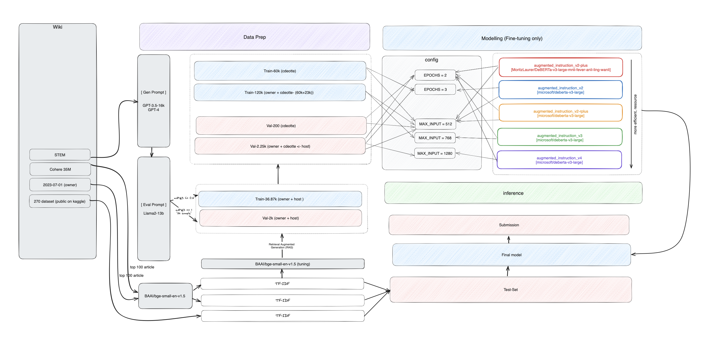

# Kaggle - LLM Science Exam - 2023 (Scaling Up LLMs Performance for Multi-Choice Science Exams Using RAG (Retrieval Augmented Generation ), TF-IDF (Term Frequency-Inverse Document Frequency), and FAISS (Facebook AI Similarity Search))
## Overall

In the Kaggle competition, we are not able to unlock certain features because Kaggle's environment does not support them. Therefore, we choose to use some cases for testing and submit them to see the momentum on the Leaderboard. This is one of the methods supported on the Kaggle environment. We might refer to the technique as RAG, which is available in the advanced system in tier-3.

## Team Members
- Teetouch Jaknamon - [@TeetouchQQ](https://github.com/TeetouchQQ), Natapong Niatarach, Kunat Pipatanakul (Guest) - [@kunato](https://github.com/kunato), Sittipong Sripaisarnmongkol ((Guest)) - [@pongib](https://github.com/pongib), Phatrasek Jirabovonvisut (Guest) - [@yoyoismee](https://github.com/yoyoismee)

## Mentor Spotlight
- Chris Deotte - [@cdeotte](https://github.com/cdeotte)
- Mohammadreza Banaei - [@MohammadrezaBanaei](https://github.com/MohammadrezaBanaei)
- Kaggle Community - [Kaggle - LLM Science Exam](https://www.kaggle.com/competitions/kaggle-llm-science-exam/discussion?sort=votes)

